# Dibujitos

## Este repositorio se creo y se clono para aprender a trabajar con mis repositorios locales en mi computadora y con repositorios remotos alojados en GitHub.

### Aquí se hará la práctica de GitHub2, en donde:

## 1. Se crea el repositorio llamado Dibujitos

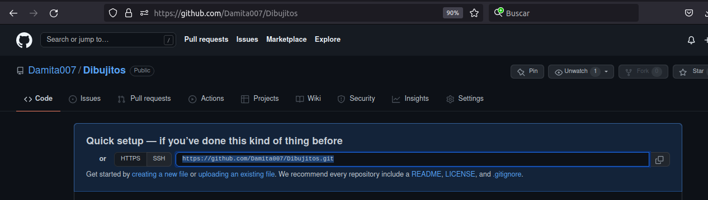

## 2. Clone el repositorio en mi computadora a través de Gitkraken

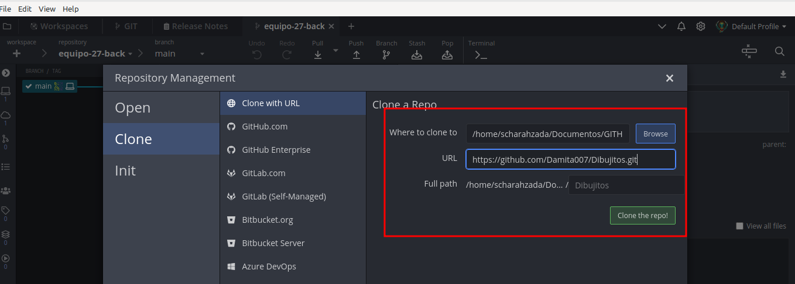

Una vez clonado el repositorio así queda:

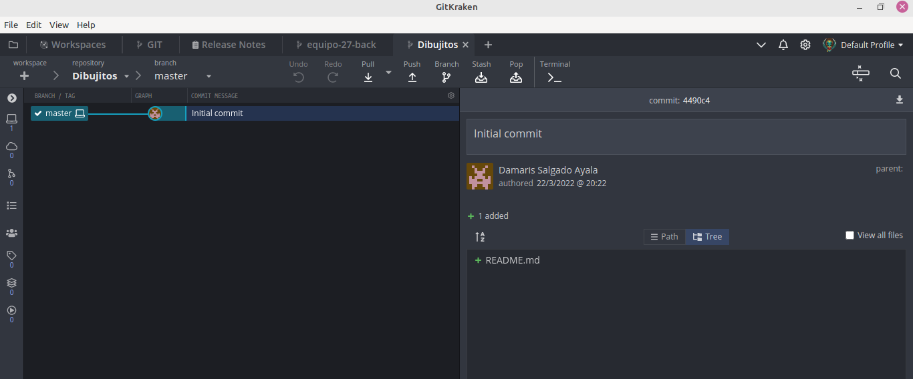

## 3. Agrega un archivo, en este caso dos existentes y un README

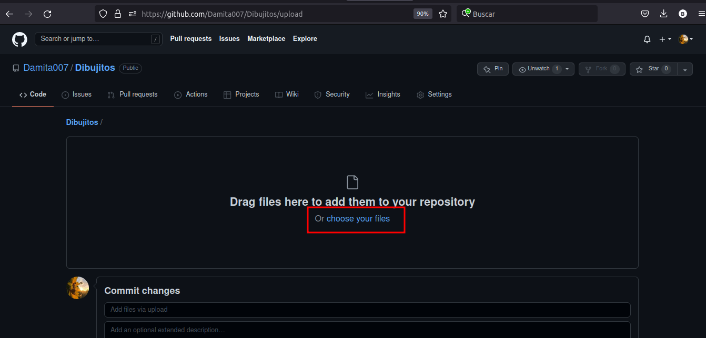

Así queda una vez que se escogen los archvios:

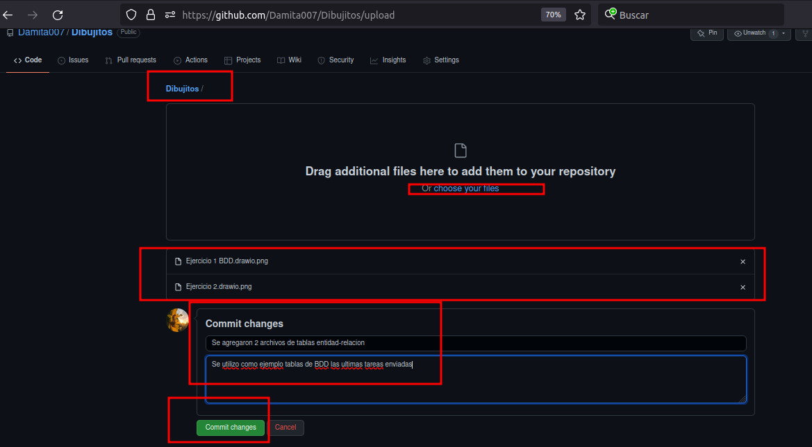

## 4. Has tu primer commit y push 
Commit - fotografía instantánea del cambio realizado.

Push - actualizar y que los cambios aparezcan en el repositorio remoto.

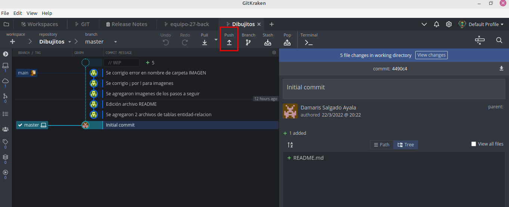

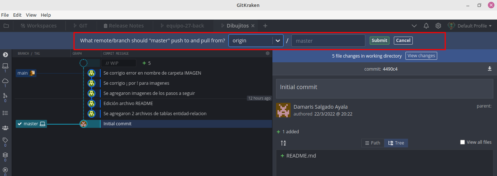

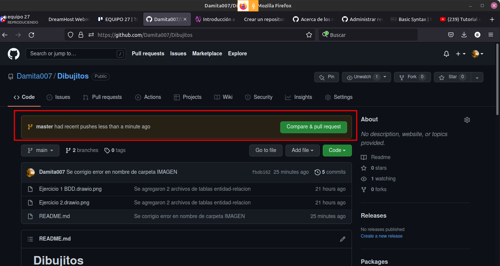

## 5. Crea una rama en tu repo local 

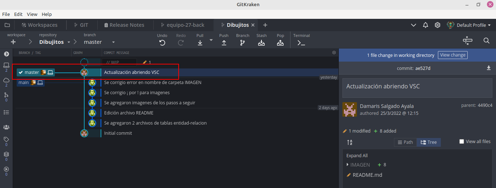

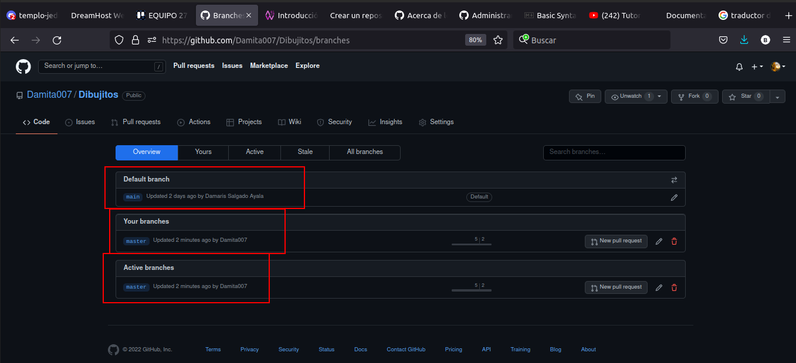

## 6. Sube esa rama a tu repo remoto. 

Main es la rama principal de mi repositorio local

** Master ** es una rama que esta en el repositorio remoto como Damita007. Aquí es donde se ven las carpetas y archivos de imágenes.

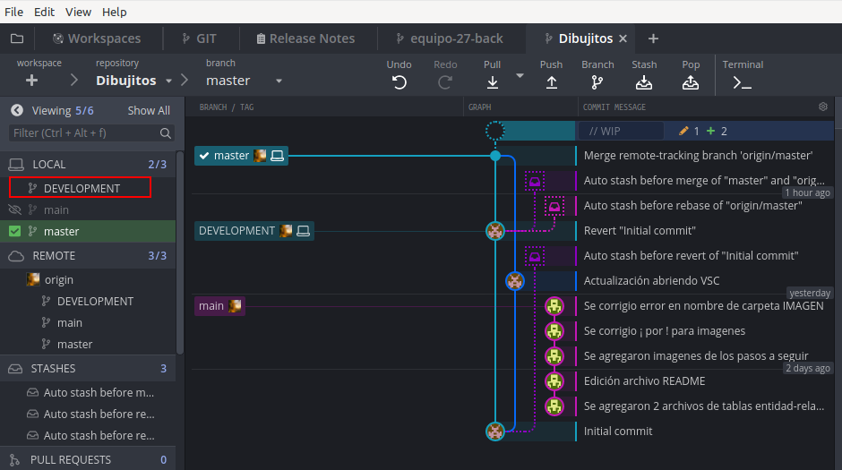

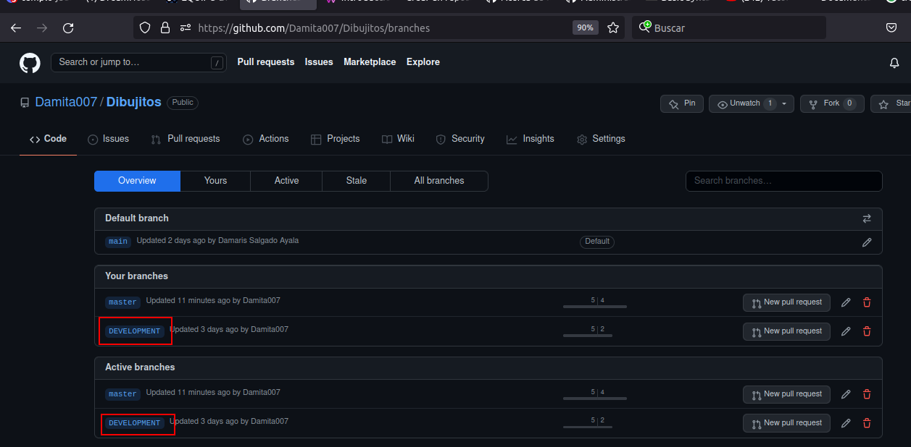

# Necesitas subir capturas de pantalla de los 5 puntos, las capturas las puedes subir en 1 solo archivo PDF.

